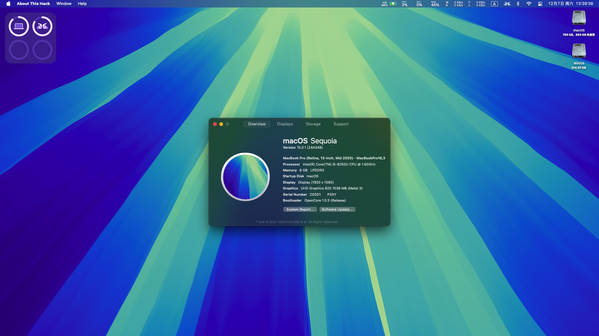

# ASUS-Zenbook-U4100U-OpenCore-EFI

OpenCore EFI for macOS.

Current status:

- [x] Power/Sleep
- [x] Keyboard/Keyboard Backlight
- [x] USB Port Mapping
- [x] Audio/Headphone Jack/Microphone
- [x] Camera
- [x] Trackpad
- [x] Wi-Fi
- [x] Bluetooth
- [x] Multi-System Switching

